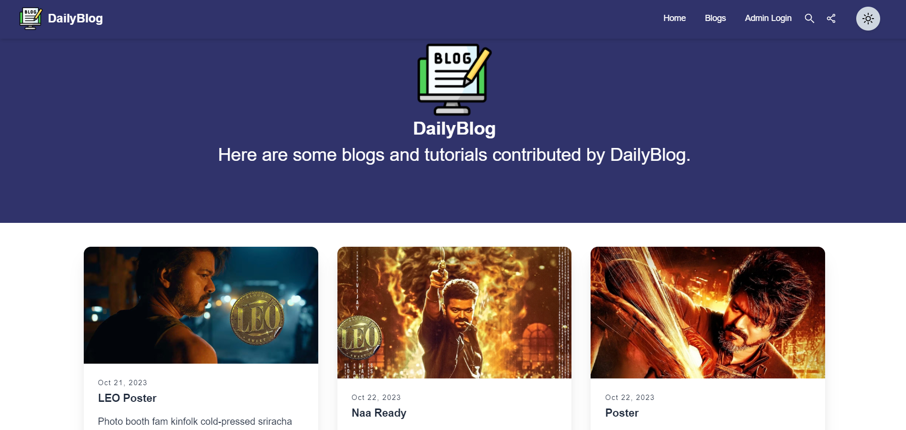

# DailyBlog - React Blog App

## Table of Contents

- [Links](#links)
- [Description](#description)
- [Screenshot](#screenshot)
- [Demo](#demo)
- [Features](#features)
- [Technologies Used](#technologies-used)
- [Usage](#usage)
- [What I Learned](#what-i-learned)
- [Contributing](#contributing)

## Links

- Solution URL: [GitHub Repository](https://github.com/aruntutter/blog-website-with-react-firebase-and-vite)
- Live Demo: [Live Demo URL](https://blog-website-seven-weld.vercel.app/)

## Description

DailyBlog is a blog website built using React, Tailwind CSS, and Firebase. It provides a platform for users to create, update, and read blog posts. The website also includes an admin login functionality for managing blog content.

## Screenshot

## Demo

Check out the live demo of DailyBlog: [Here](https://blog-website-seven-weld.vercel.app/)

## Features

- User-friendly blog interface
- Admin login for content management
- Create, update, and read blog posts
- Seamless integration with Firebase for data storage

## Technologies Used

- React
- Tailwind CSS
- Firebase

## Usage

To use DailyBlog, follow these steps:

1. Visit the live demo link: [Live Demo URL](https://blog-website-seven-weld.vercel.app/)
2. Explore the blog posts and functionalities
3. Login as an admin to manage blog content

## What I Learned

During the development of DailyBlog, I gained insights into the following:

- Integrating Firebase with React for data storage
- Implementing user authentication for admin functionalities
- Enhancing UI/UX with Tailwind CSS

## Contributing

Contributions to DailyBlog are welcome! If you have bug reports, feature suggestions, or want to submit pull requests, please refer to the [GitHub Repository](https://github.com/aruntutter/blog-website-with-react-firebase-and-vite) for more details.
